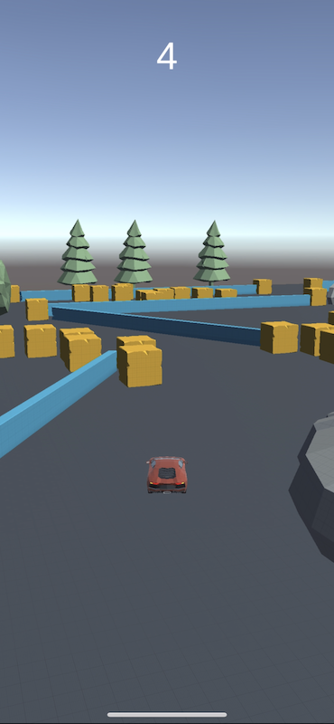
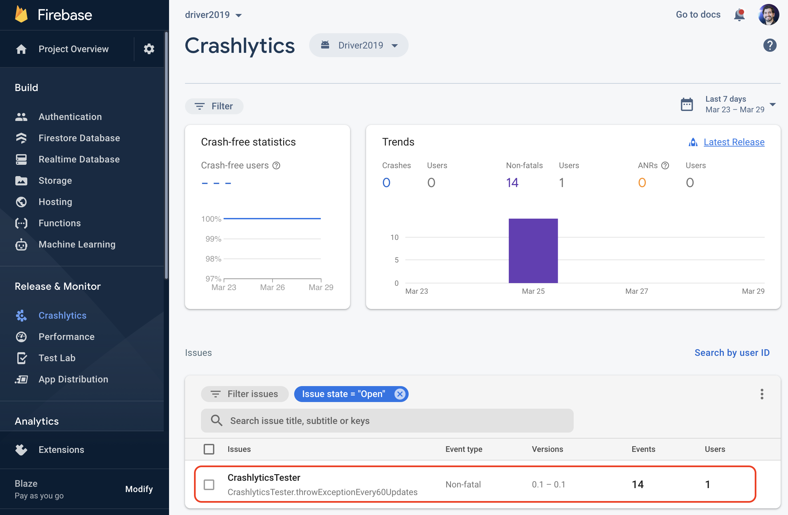

# skillz-integration-unity

This folder is meant to test different versions of the Skillz SDK on different versions of Unity (i.e. 2019, 2020, and 2021).

The recommended way to do this is by doing the following steps:

* Copy any of the games in [_game-templates](_game-templates) into the [implementations](implementations) folder using the steps in the [Create New Game from Specific Template](#create-new-game-from-specific-template) section.
  * The game folders take the naming syntax of **GAME_NAME-UNITY_VERSION** (i.e. Driver-2019.4.35f1).
* Follow the version specific Skillz SDK integration instructions from [docs.skillz.com](https://docs.skillz.com/docs/installing-skillz-unity).
* If you are integrating Firebase, follow the instructions in the [Firebase](#firebase) section.

Table of Contents
=================

* [skillz\-integration\-unity](#skillz-integration-unity)
  * [Driver Sample Unity Game](#driver-sample-unity-game)
  * [Integrate the Skillz SDK](#integrate-the-skillz-sdk)
    * [1\. Clone a Game Template](#1-clone-a-game-template)
    * [2\. Open the Cloned Unity Project](#2-open-the-cloned-unity-project)
    * [3\. Integrate the Skillz SDK](#3-integrate-the-skillz-sdk)
    * [Troubleshooting](#troubleshooting)
    * [Accepting Android License Agreements](#accepting-android-license-agreements)
  * [Integrate the Firebase Crashlytics SDK](#integrate-the-firebase-crashlytics-sdk)
  * [Contributing](#contributing)
  * [TODOs](#todos)

## Driver Sample Unity Game

`Driver` is a simple driving game where the goal is to be able to drive for as long as possible without crashing. The longer you are driving, the bigger your score gets. Tap the left side of the screen to turn left and tap right to turn right.

<p align="center">
  
</p>

The Driver game is based on one of the tutorials in a Unity 3D course from [GameDev.tv](https://GameDev.tv). Specifically, it is based on [this commit](https://gitlab.com/GameDevTV/UnityMobile/simpledriving/-/tree/90e7d1e4a2a22b6f571f67421a2c22883b493465), which has been modified for the purposes of integrating the Skillz SDK.

In the [_game-templates](_game-templates) folder, you will find the following versions of the Driver Game:

* [Driver-2019.4.35f1](_game-templates/Driver-2019.4.35f1)
* [Driver-2020.3.27f1](_game-templates/Driver-2020.3.27f1)
* [Driver-2021.2.10f1](_game-templates/Driver-2021.2.10f1)

Each version of the game has the exact game logic in their respective **Assets/Scripts** directory. The main difference amongst them is the version of Unity (i.e. 2019) and the corresponding package versions.

Let's use [Driver-2019.4.35f1](Driver-2019.4.35f1) as an example to breakdown the folder structure that's relevant for the purposes of testing the Skillz SDK:

* [Assets](_game-templates/Driver-2019.4.35f1/Assets)
  * [Scenes](_game-templates/Driver-2019.4.35f1/Assets/Scenes)
    * [Scene_MainMenu.unity](_game-templates/Driver-2019.4.35f1/Assets/Scenes/Scene_MainMenu.unity)
      * This is the main menu scene.
      * The scripts in this scene are used to initialize the Skillz and Firebase SDKs.
    * [Scene_Game.unity](_game-templates/Driver-2019.4.35f1/Assets/Scenes/Scene_Game.unity)
      * This is the car gameplay scene.
      * After successful integration, the Skillz SDK will launch this scene.
    * [Scene_FinalScore.unity](_game-templates/Driver-2019.4.35f1/Assets/Scenes/Scene_FinalScore.unity)
      * This scene gets called to show the final score after the gameplay has finished.
      * After successful integration, pressing the button in this scene will submit the final score to Skillz.
    * [Track Assets.unity](_game-templates/Driver-2019.4.35f1/Assets/Scenes/Track%20Assets.unity)
      * This scene is used to track the assets from the game.
      * Not really relevant to Skillz integration.
  * [Scripts](_game-templates/Driver-2019.4.35f1/Assets/Scripts)
    * [MainMenu.cs](_game-templates/Driver-2019.4.35f1/Assets/Scripts/MainMenu.cs)
      * Used in the `Scene_MainMenu` scene to keep handle the button logic and Skillz Initialization logic.
    * [SkillzGameController.cs](_game-templates/Driver-2019.4.35f1/Assets/Scripts/SkillzGameController.cs)
      * Used in the `Scene_MainMenu` scene to handle Skillz delegate logic.
    * [CrashlyticsInit.cs](_game-templates/Driver-2019.4.35f1/Assets/Scripts/CrashlyticsInit.cs)
      * Used in the `Scene_MainMenu` scene to initialize Firebase Crashlytics.
    * [CrashlyticsTester.cs](_game-templates/Driver-2019.4.35f1/Assets/Scripts/CrashlyticsTester.cs)
      * Used in the `Scene_MainMenu` scene to send Test Crashes to Firebase Crashlytics.
    * [Car.cs](_game-templates/Driver-2019.4.35f1/Assets/Scripts/Car.cs)
      * Used in the `Scene_Game` scene to handle car movement and crash logic.
    * [ScoreSystem.cs](_game-templates/Driver-2019.4.35f1/Assets/Scripts/ScoreSystem.cs)
      * Used in the `Scene_Game` scene to handle the logic that keeps track of the score in-game.
    * [FinalScore.cs](_game-templates/Driver-2019.4.35f1/Assets/Scripts/FinalScore.cs)
      * Used in the `Scene_FinalScore` scene to handle the logic that shows the final score on the screen and the logic that submits the score to Skillz.
* [Packages](_game-templates/Driver-2019.4.35f1/Driver-2019.4.35f1/Packages)
  * This folder has the [manifest.json](_game-templates/Driver-2021.2.10f1/Packages/manifest.json) file, which lists the versions of the packages that are specific to the Unity Version.
  * This is perhaps what changes the most across the different Unity versions of the Driver game.
    * For example, the `com.unity.device-simulator` package is built into Unity 2021, but shows as `3.0.3-preview` in Unity 2020 and 2019.

## Integrate the Skillz SDK

Now that you understand the basics of the `Driver` game and the Unity project setup, in this section, let's integrate the Skillz SDK.

### 1. Clone a Game Template

Before you clone a game template, please close the `Unity` and `Unity Hub` applications.

To clone a game template, run the following steps in your terminal:

```bash
# Go to implementations folder
cd implementations

# Select your desired game (only Driver for now)
GAME_NAME="Driver"

# Select your Unity Version by uncommenting one of the versions below
#UNITY_VERSION="2019.4.35f1"
#UNITY_VERSION="2020.3.27f1"
#UNITY_VERSION="2021.2.10f1"

# Select your desired SDK version by uncommenting one of the versions below
#SDK_VERSION="27.2.8"
#SDK_VERSION="28.0.5"
#SDK_VERSION="28.0.11"
#SDK_VERSION="28.0.17"

# New Game Directory
GAME_DIRECTORY="${GAME_NAME}-${UNITY_VERSION}-SDK-${SDK_VERSION}"

cp -r "../_game-templates/${GAME_NAME}-${UNITY_VERSION}" "./${GAME_DIRECTORY}"

# Go to your game directory
cd "./${GAME_DIRECTORY}"

# Remove any environment specific files
rm -rf .vscode Library Temp

# Remove the build directories
rm -rf Build
rm -rf Builds
```

You should have a clean copy of the game template.

### 2. Open the Cloned Unity Project

Now open Unity Hub and open the Unity Project in `${GAME_DIRECTORY}`.

Unity Hub might ask you to install the specific version of Unity that this project was built with. Go ahead and let it install it and open the game with it.

You might be prompted to install an updated version of Unity. For the sakes of this tutorial and to avoid unnecessary complications, please stick to the version that the project was built with.

Once you open the game, feel free to test it on an Android or iOS Device to make sure it works properly before moving on with the next section.

### 3. Integrate the Skillz SDK

Up to this point, you should have a working `Driver` game with all of the following Skillz Logic implemented but commented out.

* [Launch the Skillz UI](https://docs.skillz.com/docs/launch-skillz-ui)
* [Set Up Core Loop & Gameplay](https://docs.skillz.com/docs/play-and-compare-gameplay)

In this section, you will install the Skillz SDK in the Unity project and then go to each relevant file and enable the Skillz SDK logic. To do so, run the following steps:

* Open [docs.skillz.com](https://docs.skillz.com/docs/installing-skillz-unity) and select the desired SDK version in the top left dropdown.
* Follow steps 1-4 from the [Install the SDK](https://docs.skillz.com/docs/installing-skillz-unity) guide in your Unity Project.
  * Make sure you add your Game ID in the Skillz Menu in Unity.
* To enable the Skillz logic, open these files in your Unity Project and perform the following steps:
  * **Assets/Scripts/MainMenu.cs**
    * Comment out line 22.
    * Uncomment line 23.
  * **Assets/Scripts/FinalScore.cs**
    * Comment out line 30.
    * Uncomment lines 25, 32, and 35 to 51
  * **Assets/Scripts/SkillzGameController.cs**
    * Uncomment from line 1 to 25.
* Follow the steps in the [Step 5 - Build and Run](https://docs.skillz.com/docs/installing-skillz-unity#5-build-and-run) section to deploy the Skill-enabled game to your iOS or Android Device.

If successful, you should be able to see the Skillz UI, Launch into a game, and see the final score on the Skillz UI.

### Troubleshooting

If you are having issues opening a newly cloned Unity Project, try the following:

* Close Unity and Unity Hub.
* Delete the `Library` and `Temp` folders.
* Open Unity again and open Project.

The above will rebuild the project from scratch, hopefully fixing all the dependency and caching issues.

### Accepting Android License Agreements

Sometimes, when you are building and deploying an app to an Android device, you will get an error message asking you to accept the license for a given Android API version.

Every Unity installation comes with its own JDK and Android SDK installations. In order to properly accept the license for a given Android API, you need to use the specific Android SDK and JDK that corresponds to the specific Unity installation.

The following is meant to be a helper script to help you accept the SDK license for a single Android API using the Command Line on macOS:

```bash
# Get the exact Unity Version
UNITY_VERSION="2020.3.27f1"

# Set the Android SDK_ROOT variable using the Unity Version
SDK_ROOT="/Applications/Unity/Hub/Editor/${UNITY_VERSION}/PlaybackEngines/AndroidPlayer/SDK"

# Set the JAVA_HOME variable using the Unity Version
export JAVA_HOME="/Applications/Unity/Hub/Editor/${UNITY_VERSION}/PlaybackEngines/AndroidPlayer/OpenJDK/jre"

# Set the Android API variable
# This is the API that you need to accept the license for
API="android-28"

# Accept License using the sdkmanager tool in the SDK's root directory
"${SDK_ROOT}/tools/bin/sdkmanager" "platforms;${API}" --sdk_root=${SDK_ROOT}
```

You can also achieve the same result by opening the exported Android Studio project and using its GUI to accept the license there when prompted.

**NOTE:** You may need to perform the above steps for each Android API that requires you to do so.

## Integrate the Firebase Crashlytics SDK

A lot of developers use the [Firebase](https://firebase.google.com/) suite of [products](https://firebase.google.com/docs/unity/setup#available-libraries) to simplify the developing, distributing, and monitoring (amongst other activities) of their Unity Games.

One of the most popular Firebase packages is [Firebase Crashlytics](https://firebase.google.com/docs/crashlytics/get-started?platform=unity), which is used to monitor and debug application crashes caused by Game code and other 3rd party SDKs, such as the Skillz SDK. The ability to integrate Firebase Crashlytics into a Skillz-enabled game is crucial to catch problems and fix them quickly.

**NOTE:** At the time of writing, the latest Unity Firebase version supported by the Skillz SDK is [8.6.2](https://dl.google.com/firebase/sdk/unity/firebase_unity_sdk_8.6.2.zip). As long as you stay within the same major Firebase SDK version, you should be able to integrate it into your Skillz Enabled Unity Game without a problem.

In order to integrate Firebase Crashlytics into your Unity Project, follow the steps in the [Get started with Firebase Crashlytics](https://firebase.google.com/docs/crashlytics/get-started?platform=unity) guide to do the following:

* Create a Firebase account.
* Create a Firebase project.
* Register your Unity Game apps with Firebase.
* Download the [Firebase SDK]([8.6.2](https://dl.google.com/firebase/sdk/unity/firebase_unity_sdk_8.6.2.zip)) and install the `FirebaseCrashlytics.unitypackage` package into your Unity Project.
* Download the Firebase configuration files for iOS and Android into your Project's **Assets** directory.
* Initialize Firebase and Start sending test crashes to Crashlytics.
  * The code to initialize Firebase ([Step 2](https://firebase.google.com/docs/crashlytics/get-started?platform=unity#initialize-crashlytics)) and send test crashes to Crashlytics ([Step 5](https://firebase.google.com/docs/crashlytics/get-started?platform=unity#force-test-crash)) has already been added to the following files in the **Assets** folder, respectively:
    * `CrashlyticsInit.cs` which is used by the `CrashlyticsInitializer` GameObject in the `Scene_MainMenu` scene.
    * `CrashlyticsTester.cs` which is used by the `CrashlyticsTestCrash` GameObject in the `Scene_MainMenu` scene.

Once Firebase Crashlytics has been setup in your Unity Project along with the configuration files, you need to enable the Firebase Crashlytics initialization code by uncommenting lines 6 and 12-30 in the `CrashlyticsInit.cs` file.

Now try building and deploying your game to your iOS or Android device and let it run for a few minutes.

Now open your Crashlytics Dashboard in your Firebase project and select your registered app in the top dropdown, as shown below:

<p align="center">
  
</p>

If you can see the `CrashlyticsTester.throwExceptionEvery60Updates` crash as shown above, then you have integrated Firebase Crashlytics successfully!!!

## Contributing

When contributing back to the Driver game, please make sure that the game logic is exactly the same on all versions of the Driver game in the [_game-templates](_game-templates) folder. That way, when cloning a project, the user can just focus on Skillz SDK integration.

## TODOs

* Make sure the above steps work with Unity on Windows.
* Create more elaborate guidelines for contribution
